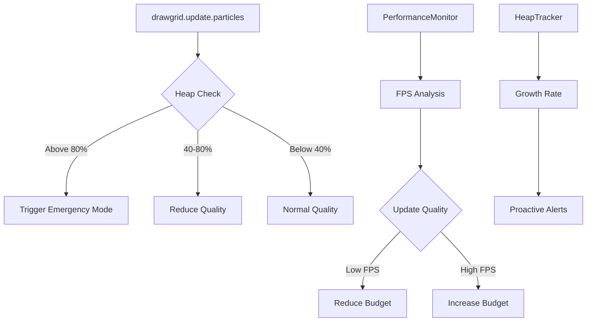

# Performance Analysis Report

## Latest Report: `resources/perf-lab-results-2026-01-08T13-52-42-627Z.json`

### Test Scenarios Analyzed

| Scenario | Toys | Avg FPS | p50 FPS | p99 FPS | Memory Peak | Status |
|----------|------|---------|---------|---------|-------------|--------|
| P7a_mixed_chains_playing_panzoom_all | 32 | 21.8 | 20 | 10 | 25.9 MB | ✅ Acceptable |
| P7b_mixed_chains_playing_panzoom_some_empty | 32 | 22.2 | 20 | 8.6 | 24.3 MB | ✅ Acceptable |
| P4b_panzoom_playing_mixed_toys_sparse | 48 | 12.2 | 10 | 4.3 | 44.9 MB | ⚠️ Marginal |
| P3f_drawgrid_playing_panzoom_rand_once_anchor_on | 48 | 8.8 | 10 | 3.5 | 73 MB | 🔴 Critical |

### Critical Findings

1. **Memory Pressure at Scale**: P3f hit 73MB heap usage, triggering `MEMORY_CRITICAL_MB` threshold, causing 35ms avg particle update time (vs 7.5ms normal)

2. **48 Toys is the Breaking Point**: Performance degrades significantly beyond 32 toys:
   - 32 toys: ~22 FPS avg, particle updates ~7.5ms
   - 48 toys: ~8-12 FPS avg, particle updates 18-35ms

3. **Panzoom + Particles = Heavy**: Panzoom operations during particle rendering compound the overhead

### Current System Limitations

- `MEMORY_CRITICAL_MB` (80MB) threshold may be too high for Chrome's memory limits
- Particle budget reduction is aggressive (multiplied by 0.7 each step)
- No proactive heap growth rate detection
- No per-toy particle count awareness

### Recommended Improvements

#### Priority 1: Memory Threshold Refinement
```javascript
// Current (too high)
MEMORY_WARNING_MB: 40
MEMORY_CRITICAL_MB: 80

// Proposed (safer)
MEMORY_WARNING_MB: 32
MEMORY_CRITICAL_MB: 56
```

#### Priority 2: Heap Growth Rate Detection
Add tracking of heap growth between measurements to enable proactive quality reduction before hitting thresholds.

#### Priority 3: Particle Cap Scaling
Scale max particles based on heap usage percentage, not just fixed caps.

### Architecture Diagram



### Files Involved
- [`src/particles/ParticleQuality.js`](src/particles/ParticleQuality.js) - Quality management
- [`src/drawgrid.js`](src/drawgrid.js:2539) - Particle update calls
- [`src/perf/perf-lab.js`](src/perf/perf-lab.js) - Benchmark runner
