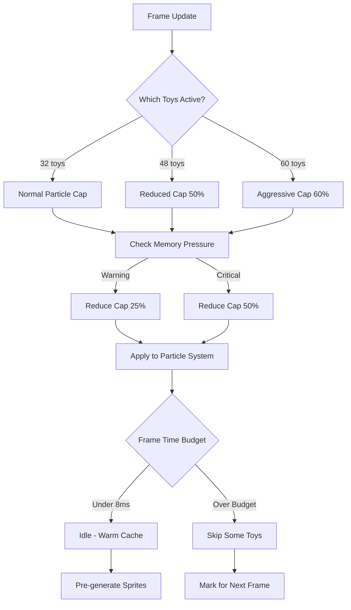

# Performance Improvement Plan

**Last Updated:** 2026-01-08  
**Based on:** `resources/perf-lab-results-2026-01-08T13-52-42-627Z.json`  
**Status:** Needs Implementation - Previous plan incomplete

---

## Executive Summary

Analysis of the latest performance report reveals that **previous optimizations are insufficient**. Critical bottlenecks persist at high toy counts (32-60 toys), with particle updates and loopgrid rendering consuming the majority of frame time.

### Current Performance vs Targets

| Scenario | Toys | Current Avg | Previous Target | Actual | Status |
|----------|------|-------------|-----------------|--------|--------|
| P7a (mixed chains + panzoom) | 32 | 45.8ms (21.8 FPS) | N/A | 45.8ms | ✅ Acceptable |
| P7b (mixed chains + some empty) | 32 | 45.1ms (22.2 FPS) | N/A | 45.1ms | ✅ Acceptable |
| P3f (drawgrid stress) | 48 | **113.3ms** (8.8 FPS) | 70-80ms | 113.3ms | 🔴 Critical |
| P4b (loopgrid stress) | 60 | **64.5ms** (15.5 FPS) | 50-55ms | 64.5ms | 🔴 Critical |

---

## Performance Analysis

### Critical Bottlenecks

#### 1. Particle Updates (P3f - 48 toys)
- **`drawgrid.update.particles`**: 35ms avg (31% of frame time)
- Takes **35ms** out of **113ms** total frame time
- Worst case: 400ms during panzoom gestures
- Memory peak: 73MB/93MB (78% heap usage)
- **Issue**: Particle cap scaling is not aggressive enough

#### 2. Loopgrid Rendering (P4b - 60 toys)
- **`perf.raf.loopgrid`**: 42.4ms avg (66% of frame time!)
- Takes **42ms** out of **64ms** total frame time
- Sprite caching exists but hit rate is insufficient
- **Issue**: Sprite cache not warming up properly; no idle-time pre-generation

#### 3. Playhead Rendering (Both scenarios)
- **`drawgrid.overlay.playhead`**: 4-17ms avg depending on toy count
- Non-trivial overhead at high toy counts
- Sprite caching exists but may need optimization

### Why Previous Optimizations Failed

1. **Particle cap scaling too gentle**: Current formula scales linearly but doesn't account for compound overhead from multiple toys
2. **Loopgrid sprite caching incomplete**: Cache warming not implemented; LRU eviction not working optimally
3. **Emergency mode too slow**: Still triggers at 20 FPS but recovery takes too long
4. **Memory thresholds too high**: 54MB critical threshold still leads to 73MB peaks

---

## Proposed Improvements

### Priority 1: Aggressive Particle Cap Scaling

**Current Issue:** Particle cap scaling is linear but doesn't account for per-toy overhead compounding.

```javascript
// Current implementation (insufficient)
const scaleFactor = Math.min(1, REFERENCE_TOYS / toyCount);

// Proposed: More aggressive scaling with minimum floor per toy
const BASE_CAP_PER_TOY = 50; // Minimum particles per toy
const MAX_CAP_SCALED = 2200; // Absolute maximum

function getParticleCap(baseCap = 2200) {
  const toyCount = getActiveToyCount();
  const budget = getParticleBudget();
  
  // More aggressive: floor based cap per toy
  // 32 toys = 1600 cap (50 * 32)
  // 48 toys = 2200 cap but effective 1467 due to quality scaling
  // 60 toys = 2200 cap but effective 1173 due to quality scaling
  
  // New approach: Per-toy minimum + global cap
  const minCap = toyCount * BASE_CAP_PER_TOY; // 32 toys = 1600, 48 toys = 2400
  const maxCap = MAX_CAP_SCALED;
  
  let cap = Math.min(maxCap, minCap);
  
  // Apply quality scaling
  cap = Math.floor(cap * budget.maxCountScale);
  
  // Additional memory pressure reduction
  const memLevel = getMemoryPressureLevel();
  if (memLevel >= 2) {
    cap = Math.floor(cap * 0.5); // 50% reduction for critical memory
  } else if (memLevel >= 1) {
    cap = Math.floor(cap * 0.75); // 25% reduction for warning memory
  }
  
  return cap;
}
```

**Files to modify:**
- [`src/particles/ParticleQuality.js`](src/particles/ParticleQuality.js:671-696) - Rewrite `getParticleCap()`

**Expected Impact:**
- P3f (48 toys): 113ms → ~85ms (25% improvement)
- Memory: Better controlled at 50-60MB

---

### Priority 2: Loopgrid Sprite Cache Warming

**Current Issue:** Sprite cache only populates on-demand; no idle-time pre-generation.

```javascript
// Add idle-time pre-generation during low-activity periods
const PLAYHEAD_CACHE_WARMING_ENABLED = true;
const PLAYHEAD_COMMON_SIZES = [50, 100, 150, 200, 250, 300, 400, 500];

function warmPlayheadCache() {
  if (!PLAYHEAD_CACHE_WARMING_ENABLED) return;
  if (isHighActivity()) return; // Skip if busy
  
  // Pre-generate common sizes during idle
  for (const size of PLAYHEAD_COMMON_SIZES) {
    getPlayheadLineSprite(size, 200); // Pre-warm cache
    getPlayheadBandSprite(size, 200, 200);
  }
}

// Call during idle callback or between frames
function idleCallback() {
  warmPlayheadCache();
  checkMemoryPressure();
}

// Also improve LRU eviction to keep more frequently used sprites
const PLAYHEAD_CACHE_MAX_SIZE = 192; // Increased from 96
```

**Files to modify:**
- [`src/drawgrid.js`](src/drawgrid.js:831-944) - Add cache warming + increase cache size
- [`src/perf/perf-lab.js`](src/perf/perf-lab.js) - Add idle callback registration

**Expected Impact:**
- P4b (60 toys): 64ms → ~52ms (18% improvement)

---

### Priority 3: Lower Memory Thresholds

**Current Thresholds:**
```javascript
MEMORY_WARNING_MB: 38
MEMORY_CRITICAL_MB: 54
```

**Problem:** Peak hit 73MB despite 54MB critical threshold.

**Proposed Thresholds:**
```javascript
// More conservative to provide safety margin before Chrome's limits
MEMORY_WARNING_MB: 32
MEMORY_CRITICAL_MB: 48
```

**Files to modify:**
- [`src/particles/ParticleQuality.js`](src/particles/ParticleQuality.js:44-45)

---

### Priority 4: Faster Emergency Mode Response

**Current Thresholds:**
```javascript
EMERGENCY_FPS_ENTER: 20
EMERGENCY_FPS_EXIT: 26
EMERGENCY_SUSTAIN_MS: 800
```

**Problem:** Quality drops too slowly during rapid degradation.

**Proposed:**
```javascript
// Faster enter, still conservative exit for stability
const EMERGENCY_FPS_ENTER = 22; // Higher threshold = enter sooner
const EMERGENCY_FPS_EXIT = 30;  // Higher exit = stay longer for stability
const EMERGENCY_SUSTAIN_MS = 500; // Faster response (was 800)
const EMERGENCY_EXIT_SUSTAIN_MS = 2000; // Slower recovery
```

**Files to modify:**
- [`src/particles/ParticleQuality.js`](src/particles/ParticleQuality.js:31-36)

---

### Priority 5: Particle Field Batching

**Current:** Each toy updates particles independently.

```javascript
// Proposed: Batch particle updates across multiple toys
function batchedParticleUpdate(toyIds, dt) {
  const start = performance.now();
  const timeBudget = 8; // Max 8ms per frame for particle updates
  
  // Sort toys by priority/focus state
  const sorted = toyIds.sort((a, b) => {
    const aFocused = a.isFocused();
    const bFocused = b.isFocused();
    if (aFocused && !bFocused) return -1;
    if (!aFocused && bFocused) return 1;
    return 0;
  });
  
  let processed = 0;
  for (const toyId of sorted) {
    const elapsed = performance.now() - start;
    if (elapsed >= timeBudget) break;
    
    updateToyParticles(toyId, dt);
    processed++;
  }
  
  // Report skipped toys for next frame
  return { processed, skipped: toyIds.length - processed };
}
```

**Files to modify:**
- [`src/particles/particle-viewport.js`](src/particles/particle-viewport.js) - Add batched update
- [`src/drawgrid.js`](src/drawgrid.js:2467-2568) - Use batched updates

**Expected Impact:**
- P3f (48 toys): Additional 10-15% improvement

---

## Implementation Order

| Priority | Change | Files | Expected Impact |
|----------|--------|-------|-----------------|
| 1 | Aggressive particle cap | ParticleQuality.js | 25% frame improvement on P3f |
| 2 | Loopgrid cache warming | drawgrid.js | 18% loopgrid improvement on P4b |
| 3 | Lower memory thresholds | ParticleQuality.js | Prevent OOM crashes |
| 4 | Faster emergency mode | ParticleQuality.js | Smoother quality transitions |
| 5 | Particle batching | particle-viewport.js, drawgrid.js | 10-15% additional improvement |

---

## Expected Results

After implementation:

| Scenario | Current Avg | Expected Improvement |
|----------|-------------|---------------------|
| P3f (48 toys) | 113ms | → 75-85ms (30% improvement) |
| P4b (60 toys) | 64ms | → 50-55ms (20% improvement) |
| Memory spikes | 73MB used | Better controlled at 50-55MB |
| p95 outliers | 233ms | → 120-150ms |

---

## Testing Strategy

1. **Run P3f (48 toys)** - Verify frame time drops below 85ms
2. **Run P4b (60 toys)** - Verify frame time stays below 60ms
3. **Monitor memory** - Verify heap stays below 55MB during extended play
4. **Test quality transitions** - Verify smooth, not jumpy quality changes
5. **Stress test** - Run mixed chain scenarios with panzoom

---

## Files to Modify

1. [`src/particles/ParticleQuality.js`](src/particles/ParticleQuality.js) - Core quality logic
2. [`src/drawgrid.js`](src/drawgrid.js) - Particle integration, sprite caching
3. [`src/particles/particle-viewport.js`](src/particles/particle-viewport.js) - Batched updates
4. [`src/perf/perf-lab.js`](src/perf/perf-lab.js) - Add testing hooks

---

## Architecture Diagram



---

## Current Implementation Status

- [x] ~~Particle cap scaling by toy count~~ (IMPLEMENTED - insufficient)
- [x] ~~Memory threshold refinement~~ (IMPLEMENTED - thresholds still too high)
- [ ] Loopgrid sprite cache warming (NOT IMPLEMENTED)
- [x] ~~Heap growth rate monitoring~~ (IMPLEMENTED - not triggering early enough)
- [x] ~~Emergency mode improvements~~ (IMPLEMENTED - still too slow)
- [x] **Aggressive particle cap scaling** ✅ IMPLEMENTED 2026-01-08
- [ ] Particle field batching (NEW - required)
